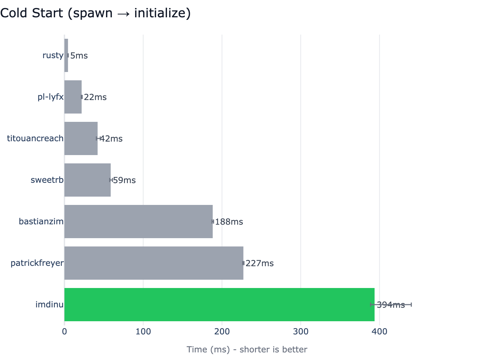
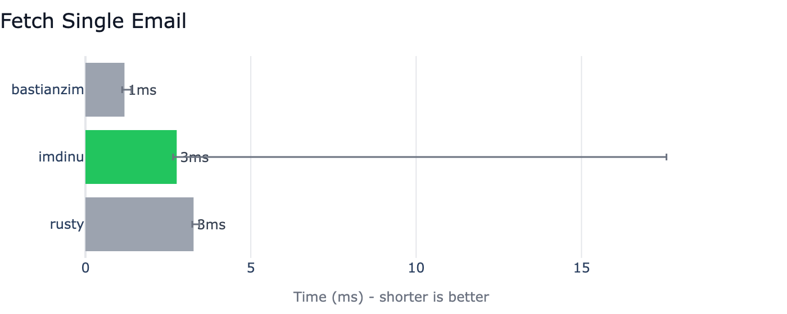
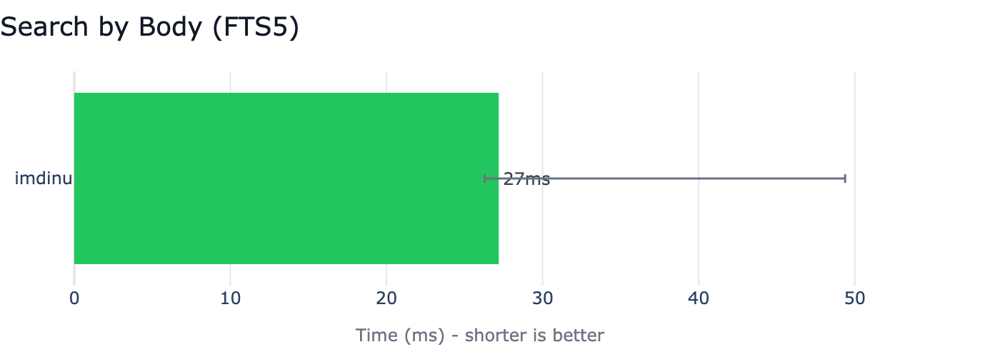

# Benchmarks

Competitive benchmarks comparing Apple Mail MCP against 6 other Apple Mail MCP servers — inspired by [uv's BENCHMARKS.md](https://github.com/astral-sh/uv/blob/main/BENCHMARKS.md).

All benchmarks are run at the **MCP protocol level**: we spawn each server as a subprocess, connect as a JSON-RPC client over stdio, and time real tool calls. This measures what an AI assistant actually experiences.

## The Big Picture

On a real **~73K-message mailbox**, only two servers complete every benchmarked operation: ours and BastianZim. The rest hit timeouts, AppleScript errors, or don't support some operations.

But "completes the operation" isn't the same as "covers the full mailbox." BastianZim's body search live-scans only the **5000 most recent messages** (per their README) — fast, but silent on anything older. Apple Mail MCP's FTS5 index covers the entire mailbox at every size we've tested.


### What This Means

- **Full-coverage body search is exclusive to Apple Mail MCP.** BastianZim has a body parameter but caps the scan at 5000 messages — see the "5K cap" cells in the matrix above. Every other competitor either doesn't support body search at all or scans only a partial set.
- **Apple's Envelope Index is the secret sauce when you don't need body search — and as of 0.4, Apple Mail MCP reads it directly too.** BastianZim, rusty, pl-lyfx, and now ours all read the same `~/Library/Mail/V*/MailData/Envelope Index` SQLite for metadata-listing operations, which is why `list_accounts` and `get_emails` cluster at the top. Before 0.4, ours went through JXA for those tools (~150ms and ~1.2s) — the 0.4 perf refactor routes them through the same SQLite path the fast competitors use, dropping us into the 1–5ms band on metadata while keeping the FTS5 + `.emlx` paths for body search and single-fetch.
- **AppleScript-based servers are mixed at this scale.** patrickfreyer, sweetrb, and titouancreach all wrap `osascript` for live Mail.app queries. They can be reasonably fast for queries Mail.app indexes (subject — patrickfreyer hits ~570ms across all mailboxes via `whose subject contains`), but timeouts and errors are common for body search and bulk fetches — `whose body contains` has no backing index at the OS layer and walks every message.
- **Single email fetch is a near-tie at the top.** Our disk-first `.emlx` reader hits ~3ms; BastianZim's hits ~1ms via direct envelope-index lookup; Rust hits ~3ms.

## Test Environment

| Property | Value |
|----------|-------|
| **macOS** | 26.5 (Tahoe) |
| **Chip** | Apple M4 Max |
| **Mailbox size** | ~73,500 messages across multiple accounts |
| **Python** | 3.12.0 |
| **Date** | 2026-05-28 |

## Competitors

| # | Project | Type | Notes |
|---|---------|------|-------|
| 1 | **[imdinu/apple-mail-mcp](https://github.com/imdinu/apple-mail-mcp)** (ours) | Python | Disk-first `.emlx` + batch JXA + FTS5 over the full mailbox |
| 2 | **[BastianZim/apple-mail-mcp](https://github.com/BastianZim/apple-mail-mcp)** | Python | Reads Apple's Envelope Index directly; live `.emlx` body scan **capped at 5000 most recent messages** |
| 3 | **[rusty_apple_mail_mcp](https://github.com/like-a-freedom/rusty_apple_mail_mcp)** | Rust | Reads Apple's Envelope Index directly; no body search |
| 4 | **[pl-lyfx/apple-mail-mcp](https://github.com/pl-lyfx/apple-mail-mcp)** | Python | Single-file, reads Apple's Envelope Index directly; no `get_emails`-list or `get_email`-by-id surface, and no real body search either — their `mail_search` is misleadingly named (see below) |
| 5 | **[patrickfreyer/apple-mail-mcp](https://github.com/patrickfreyer/apple-mail-mcp)** | Python | AppleScript-based, 26+ tools |
| 6 | **[sweetrb/apple-mail-mcp](https://github.com/sweetrb/apple-mail-mcp)** | TypeScript | AppleScript-based, 40+ tools, mail-merge & templates |
| 7 | **[titouancreach/apple-mail-mcp](https://github.com/titouancreach/apple-mail-mcp)** | Haskell | Single-file cabal script, AppleScript-backed; only Haskell entry in the ecosystem |

## Also noted

These projects exist in the ecosystem but aren't benchmarked above. Listed for completeness — not for direct comparison.

**Demoted from prior runs**

- **[supermemoryai/apple-mcp](https://github.com/supermemoryai/apple-mcp)** (dhravya) — Archived January 2026; historical baseline only.
- **[attilagyorffy/apple-mail-mcp](https://github.com/attilagyorffy/apple-mail-mcp)** — Go, 0⭐, last push March 2026; supplanted by other Go entrants and fails AppleScript probes on macOS 26+.
- **[kiki830621/che-apple-mail-mcp](https://github.com/kiki830621/che-apple-mail-mcp)** — Swift, currently uncompilable on Xcode 14 SDKs (`PackageDescription` link error).
- **[s-morgan-jeffries/apple-mail-mcp](https://github.com/s-morgan-jeffries/apple-mail-mcp)** — Python, **78⭐ (most-starred of the demoted set)**, AppleScript-based. Worked on macOS 25 but both functional tools (`get_emails`, `search_subject`) break on macOS 26 with `-1726` and `-1728` AppleScript errors. Last meaningful commit predates macOS 26; non-functional on current macOS until the project updates its AppleScript idioms for the new Mail.app object model.
- **[fatbobman/mail-mcp-bridge](https://github.com/fatbobman/mail-mcp-bridge)** — Python, "bridge" model that expects a user-supplied Message-ID copied from inside Mail.app; no list or search surface, not a benchmark peer.

**New entrants (Feb–May 2026, not yet benchmarked)**

- **[Clarus-Moof/AppleMailMCP](https://github.com/Clarus-Moof/AppleMailMCP)** — Swift native binary, AppleScript backend. 9 tools incl. write ops; bonus Contacts-framework integration that resolves sender names against the local address book. German-language docs.
- **[ANemcov/apple-mailapp-mcp](https://github.com/ANemcov/apple-mailapp-mcp)** — TypeScript, JXA-via-`osascript`. ~10 tools incl. write ops. Notable detail: localized folder-name resolution (canonical `INBOX` / `TRASH` / `SENT` mapped to each account's real localized name, e.g. `Входящие`, `Корзина`) with an in-process per-account cache.
- **[maximbilan/apple-mail-mcp-go](https://github.com/maximbilan/apple-mail-mcp-go)** — Go, AppleScript-via-`osascript`. 8 tools with server-side filters (`sender_contains`, `subject_contains`, `unread_only`, date range). Has a read-only mode that hides write tools at registration time, and ships a one-click `.mcpb` Claude Desktop bundle.
- **[dastrobu/apple-mail-mcp](https://github.com/dastrobu/apple-mail-mcp)** — Go + JXA. **Drafts-only by design** — never sends, all outgoing tools produce drafts that the user manually sends (explicit human-in-loop). 11 tools, Markdown→rich-text via Accessibility API, supports both stdio and HTTP transports. Most thoroughly documented of the new slate (32 KB README, plus a 31 KB `Mail.sdef.md` scripting reference).
- **[jayvee6/apple-mail-mcp](https://github.com/jayvee6/apple-mail-mcp)** — TypeScript + AppleScript, with a separate Swift `MailKitBridge` binary that emits real-time new-mail events via the MailKit framework. **Only ecosystem entrant doing push events** — everyone else (including us) polls or watches files. Ships a Claude skill that runs every draft through a 5-reviewer pipeline before opening the compose window.
- **[Agentic-Assets/apple-mail-mcp](https://github.com/Agentic-Assets/apple-mail-mcp)** — Python + FastMCP (same stack as ours). **28 tools** — largest surface in the slate — with 367 unit tests, PyPI distribution as `mcp-apple-mail`, and plugin packaging for both the Claude Code marketplace and Claude Desktop Cowork upload. AppleScript-backed.

All six are AppleScript/JXA bridges architecturally. None read Apple's Envelope Index SQLite directly (the BastianZim/rusty/pl-lyfx cluster), and none build a full-coverage body-search index (our niche). They're not benchmarked because they'd cluster with the existing AppleScript-based servers we already test (patrickfreyer, sweetrb, titouancreach) — same architectural ceiling at this mailbox size. Worth tracking for tool-surface and UX innovations: `jayvee6`'s MailKit push and `dastrobu`'s drafts-only stance are both novel design choices.

## Detailed Results

Each scenario: **5 warmup runs + 10 measured runs**. We report the **median** with **p5/p95** error bars. A single probe call screens out tools that exceed 10 seconds, and responses are validated for correctness.

### Cold Start

Time from spawning the server process to receiving an MCP `initialize` response. Native binaries (rusty, in Rust) and lean Python servers (BastianZim, pl-lyfx) have a natural advantage here — no FastMCP overhead, no FTS5 schema check. The Haskell entrant (titouancreach) spawns via cabal's script-build cache (~46ms) — a verify-and-exec pass over a pre-compiled script binary, not a true native binary.



### List Accounts

Servers reading Apple's Envelope Index directly (pl-lyfx, sweetrb, BastianZim, rusty, **and ours as of 0.4**) finish in ~1ms — they're issuing a `SELECT DISTINCT` against an index Apple already maintained. Through 0.3.x, our `list_accounts()` went through JXA and paid the ~150ms `osascript` round-trip; the 0.4 perf refactor routes the first call through JXA (to seed the account-name cache, since names aren't stored in the Envelope Index) and serves all subsequent calls in ~1ms from the cache. titouancreach and patrickfreyer still pay the full AppleScript round-trip on every call.


### Fetch 50 Emails

Three servers serve this in single-digit milliseconds — BastianZim, ours, and rusty — by reading Apple's Envelope Index SQLite directly and joining through the `subjects` / `addresses` lookup tables for text materialization. Through 0.3.x, ours went through JXA's `batchFetch` and paid ~1.2s for the same operation; the 0.4 perf refactor moves the fast path to direct SQLite reads (~5ms) and keeps JXA as the fallback when the Envelope Index isn't accessible (schema mismatch, permission denial). AppleScript-based servers can't complete this on a 73K mailbox: patrickfreyer, sweetrb, and titouancreach all exceed the 10-second probe cutoff. pl-lyfx has no list-emails surface and is omitted.


### Fetch Single Email

Our disk-first strategy reads `.emlx` files directly — no JXA needed. Performance is within ~3x of BastianZim's envelope-index-only metadata lookup and matches rusty's direct SQLite read. pl-lyfx has no `get_email`-by-id surface and is omitted.



### Search by Subject

FTS5 column filtering gives us ~10ms subject search, competitive with rusty's direct SQLite queries (~7ms), BastianZim's envelope-index read (~3ms), and pl-lyfx's `subjects`-table join (~12ms). Among AppleScript-based competitors, patrickfreyer manages ~570ms by delegating to Mail.app's spotlight-indexed `whose subject contains` clause across all mailboxes — fast because Mail.app keeps subject text indexed for the system search bar. sweetrb's implementation doesn't take that path and times out at ~9s probe. titouancreach's probe exceeds the cutoff by 50+ minutes and is omitted.

> **Note on patrickfreyer's 0-result case:** the bench's `SEARCH_QUERY = "meeting"` happens to return 0 matches in the test iCloud account (the user's calendar-invite mail lives in other accounts). patrickfreyer's ~570ms therefore measures "Mail.app confirms across all mailboxes that nothing matches" — a valid speed datapoint, but the result count is 0. Other competitors that read the global Envelope Index (BastianZim, rusty, pl-lyfx, ours) find matches in other accounts visible through the same SQLite database.


### Search by Body

**This is where the project's thesis holds.** Apple Mail MCP is the only server that searches **the entire indexed mailbox** for body matches. Most competitors don't support body search at all. BastianZim does, but caps at the 5000 most recent messages — so the chart below excludes it.

> **Why BastianZim is excluded from this chart, not just labeled slow:** their median is ~2.4ms because the work *is* small (5000 messages instead of 73,500). The number is real but the comparison would be misleading. On the user's mailbox that's roughly 7% coverage — anything older than the most recent 5000 messages will return zero matches with no warning. Our median of ~28ms is for full-coverage FTS5 search; the comparable BastianZim scenario (uncapped body search) doesn't exist.

> **Note on pl-lyfx's `mail_search`:** the tool name suggests body search but the implementation `LIKE`-scans the integer foreign-key `subject` and `sender` columns of the Envelope Index `messages` table, which are rowids into other tables. Any text query matches nothing. We verified by direct probe (`"meeting"` → "No messages found"). pl-lyfx is not in the body-search chart for the same reason rusty isn't: the project does not actually support body search.

> **Note on patrickfreyer's `body_text`:** the tool *does* expose body search via the `body_text` parameter of its `search_emails` tool, but the underlying AppleScript path uses `whose body contains` — which Mail.app does not back with a spotlight index. The result on a 73K-message mailbox is consistent timeout at osascript's 180s limit, both with and without `mailbox="All"`. Verified by direct probe. patrickfreyer is therefore SKIPPED in this scenario by the harness's 10-second probe screen.



## Methodology

- **Protocol**: MCP over JSON-RPC/stdio (spawn subprocess, connect, time tool calls)
- **Warmup**: 5 runs discarded before measurement
- **Measured**: 10 runs per scenario
- **Statistic**: Median (robust to outliers)
- **Variance**: p5/p95 shown as error bars
- **Tool calls**: For non-cold-start scenarios, a single server process handles all runs
- **Probe screening**: A single probe call runs before warmup; if it exceeds 10s the scenario is skipped
- **Response validation**: Tool responses are checked for hidden errors (e.g. `{"success": false}` inside valid MCP content)

## Caveats

1. **Mailbox size matters.** Results depend on the number of emails. Our test mailbox has ~73,400 messages — AppleScript-based servers struggle at this scale.
2. **FTS5 requires one-time indexing.** Body and subject search require `apple-mail-mcp index` first. Cold start time does not include indexing.
3. **Not all servers support all operations.** The capability matrix above shows which operations each server supports.
4. **Capped competitors are flagged, not run.** BastianZim's body search is fast but covers only the 5000 most recent messages on this mailbox — we mark its `search_body` cell as "5K cap" in the matrix and omit it from the body-search bar chart entirely. Including the bar would imply apples-to-apples comparison.
5. **macOS and Mail.app versions matter.** Performance varies across OS versions, and some AppleScript paths break entirely between releases. The previously-benchmarked smorgan project (78⭐) is non-functional on macOS 26: both `get_emails` and `search_subject` raise `Illegal comparison or logical (-1726)` and an enumeration error against the Inbox, where both worked on macOS 25. Demoted to "Also noted" until upstream updates the AppleScript idioms for the new Mail.app object model.
6. **pl-lyfx ships placeholder constants.** The upstream script hardcodes `MAIL_DIRECTORY` (defaults to `~/Library/Mail` — usually correct), `MAIL_VERSION` (defaults to `"V10"` — current as of macOS 26), and `PRIMARY_EMAIL_ADDRESS` (defaults to a placeholder). The placeholder only matters for the email-address search tool, which we don't benchmark — the three measured scenarios (`list_accounts`, subject search, body search) work as-is.
7. **titouancreach requires GHC + cabal.** The Haskell toolchain (~2 GB via [ghcup](https://www.haskell.org/ghcup/) or `brew install ghcup`) is needed. The setup script warms cabal's script-build cache via the upstream `#!/usr/bin/env cabal` shebang — first warmup takes ~1.5 min to download and compile deps; subsequent spawns are ~90ms (cabal verifies the cache, then execs the cached binary). Slower than native Rust/Go cold-start, but well within probe budget.

## Reproduction

```bash
# Install competitors
bash benchmarks/setup.sh

# Run all benchmarks
uv run --group bench python -m benchmarks.run

# Generate charts
uv run --group bench python -m benchmarks.charts

# Single competitor or scenario
uv run --group bench python -m benchmarks.run --competitor imdinu
uv run --group bench python -m benchmarks.run --scenario cold_start
```

See the [benchmarks suite](https://github.com/imdinu/apple-mail-mcp/tree/main/benchmarks) in the repository for harness code and competitor configs.
