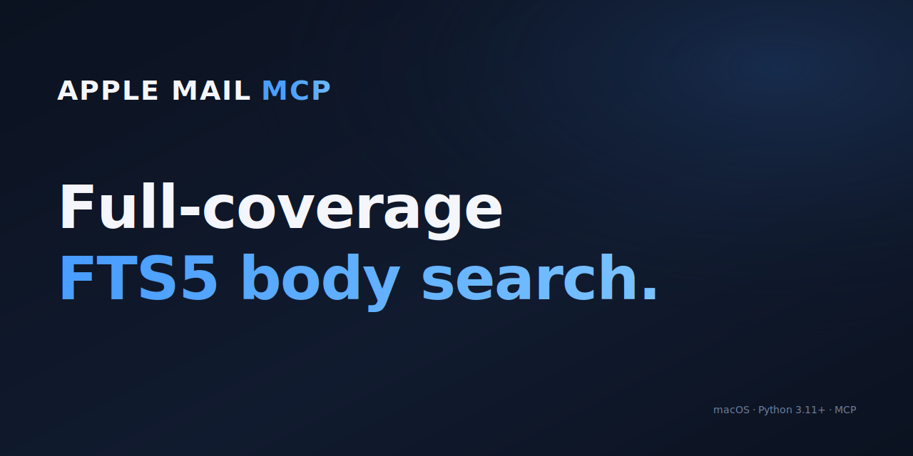

# Mac Mail MCP

<!-- mcp-name: io.github.wagamama/mac-mail-mcp -->

<p align="center">
  
</p>

[](https://www.python.org/downloads/)
[](https://www.gnu.org/licenses/gpl-3.0)
[](https://www.apple.com/macos/)
[](https://modelcontextprotocol.io/)
[](https://github.com/astral-sh/ruff)
[](https://github.com/wagamama/apple-app-mcp/actions/workflows/lint.yml)

The only Mac Mail MCP server with **full-coverage body search** — reliable on large mailboxes where AppleScript-based servers timeout. 8 tools for reading, searching, and extracting email content.

**[Read the docs](https://wagamama.github.io/apple-app-mcp/)** for the full guide.

## Quick Start

```bash
pipx install mac-mail-mcp
```

Add to your MCP client:

```json
{
  "mcpServers": {
    "mail": {
      "command": "mac-mail-mcp",
      "args": ["--watch", "serve"]
    }
  }
}
```

### Build the Search Index (Recommended)

```bash
# Requires Full Disk Access for Terminal
# System Settings → Privacy & Security → Full Disk Access → Add Terminal

mac-mail-mcp index --verbose
```

Run the MCP server with watch mode to keep the index current while new mail
arrives:

```bash
mac-mail-mcp --watch serve
```

### Configure (Optional)

```bash
mac-mail-mcp init   # writes ~/.mac-mail-mcp/config.toml
```

Writes a commented config file you can edit to set tool defaults and index
scope separately. `[defaults]` controls what MCP tools use when an account or
mailbox is omitted; `[index]` controls what data is stored in the local search
index. Every key has a matching `APPLE_MAIL_*` env var if you prefer
environment-based config. See
[Configuration](https://wagamama.github.io/apple-app-mcp/configuration/)
for the full schema and precedence rules.

Common index-scope settings:

| Variable | Purpose |
|----------|---------|
| `APPLE_MAIL_INDEX_ACCOUNTS` | Comma-separated Mail account names or account IDs to index; unset indexes all accounts. |
| `APPLE_MAIL_INDEX_EXCLUDE_ACCOUNTS` | Comma-separated Mail account names or account IDs to skip. |
| `APPLE_MAIL_INDEX_INCLUDE_MAILBOXES` | Comma-separated mailbox names to index; unset includes all non-excluded mailboxes. |
| `APPLE_MAIL_INDEX_EXCLUDE_MAILBOXES` | Comma-separated mailbox names to skip; defaults to `Drafts`. |

## Tools

| Tool | Purpose |
|------|---------|
| `list_accounts()` | List email accounts |
| `list_mailboxes(account?)` | List mailboxes |
| `get_emails(filter?, limit?)` | Get emails — all, unread, flagged, today, last_7_days |
| `get_email(message_id)` | Get single email with full content + attachments |
| `search(query, scope?, before?, after?, highlight?)` | Search — all, subject, sender, body, attachments |
| `get_email_links(message_id)` | Extract links from an email |
| `get_email_attachment(message_id, filename)` | Extract attachment content |
| `get_attachment(message_id, filename)` | *Deprecated* — use `get_email_attachment()` |

## Performance

Tested against [6 other Mac Mail MCP servers](https://wagamama.github.io/apple-app-mcp/benchmarks/) on a real **~73K-message** mailbox:

- **Only server with full-coverage body search.** Most competitors don't support body search at all; the one that does (BastianZim) live-scans only the 5000 most recent messages — silent miss on anything older. Our FTS5 index covers the entire mailbox.
- **~3ms single email fetch** via disk-first `.emlx` reading (no JXA round-trip).
- **~1ms `list_accounts` and ~5ms 50-email listing** via direct Envelope-Index SQLite reads (0.4+) — same path BastianZim/rusty/pl-lyfx use, with JXA as the correctness fallback.
- **~7ms subject search** via FTS5 — competitive with native Rust on the same operation.
- **Reliable across all 6 benchmarked operations** on a 73K mailbox; AppleScript-based servers timeout, throw syntax errors, or skip operations they don't support.


## Configuration

Mac Mail MCP works out of the box. To customize defaults, run
`mac-mail-mcp init` to generate a `config.toml` template — or use
the matching `APPLE_MAIL_*` environment variables. See the
[Configuration docs](https://wagamama.github.io/apple-app-mcp/configuration/)
for the full schema and the CLI > env > file > default precedence.

Per-client env overrides via the MCP client's launch config also work:

```json
{
  "mcpServers": {
    "mail": {
      "command": "mac-mail-mcp",
      "args": ["--watch", "serve"],
      "env": {
        "APPLE_MAIL_DEFAULT_ACCOUNT": "Work"
      }
    }
  }
}
```

## CLI Usage

All tools are also available as standalone CLI commands (no MCP server needed):

```bash
mac-mail-mcp search "quarterly report" --scope subject
mac-mail-mcp search "invoice" --after 2026-01-01 --limit 10
mac-mail-mcp read 12345
mac-mail-mcp emails --filter unread --limit 10
mac-mail-mcp accounts
mac-mail-mcp mailboxes --account Work
mac-mail-mcp extract 12345 invoice.pdf
```

All commands output JSON. Generate a [Claude Code skill](https://wagamama.github.io/apple-app-mcp/configuration/#cli-commands) for CLI-based access:

```bash
mac-mail-mcp integrate claude > "$HOME/.claude/skills/mac-mail.md"
```

## Development

```bash
git clone https://github.com/wagamama/apple-app-mcp
cd apple-app-mcp
uv sync
uv run ruff check packages/mac-mail-mcp/src
uv run --package mac-mail-mcp pytest packages/mac-mail-mcp/tests
```

## License

GPL-3.0-or-later
